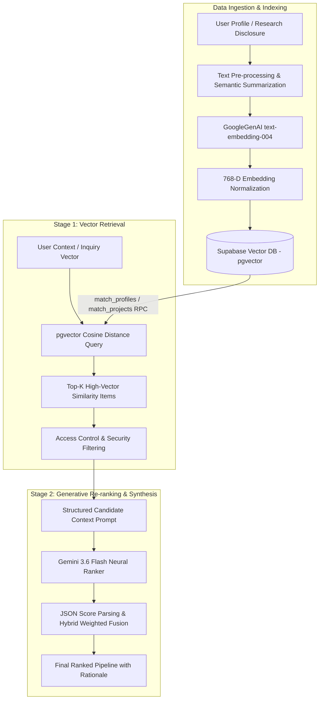

# Retrieval-Augmented Generation (RAG) System Architecture
## University of Ghana Virtual Industry Hub (UG-VIH)

---

## 1. Executive Summary

The **University of Ghana Virtual Industry Hub (UG-VIH)** implements a **Hybrid 2-Stage Retrieval-Augmented Generation (RAG)** system designed to bridge the gap between academic research disclosures, industrial partners, investors, and interdisciplinary scholars. 

Rather than relying purely on standard keyword search or raw Large Language Model (LLM) generation, UG-VIH combines:
1. **Dense Vector Retrieval (Stage 1)**: Powered by Google Gemini's `text-embedding-004` model (768-dimensional embeddings) and PostgreSQL `pgvector` similarity functions (`match_profiles` and `match_projects`).
2. **Generative Synthesis & Contextual Re-ranking (Stage 2)**: Powered by `gemini-3.6-flash`, which consumes top-$K$ retrieved context and performs multi-factor alignment, generating strategic similarity scores and qualitative rationale.

```
+-----------------------------------------------------------------------------------+
|                            UG-VIH RAG PIPELINE                                     |
|                                                                                   |
|  [User Profile / Query]                                                           |
|          |                                                                        |
|          v                                                                        |
|  +-----------------------+      +-------------------------+                       |
|  | Embedding Service     | ---> | 768-D Vector (v_query)  |                       |
|  | (text-embedding-004)  |      +-------------------------+                       |
|  +-----------------------+                   |                                    |
|                                              v                                    |
|                                 +-------------------------+                       |
|                                 | PgVector RPC Search     |                       |
|                                 | (Cosine Similarity)     |                       |
|                                 +-------------------------+                       |
|                                              |                                    |
|                                              v                                    |
|                                 +-------------------------+                       |
|                                 | Top-20 Context Candidates |                      |
|                                 +-------------------------+                       |
|                                              |                                    |
|                                              v                                    |
|  +-----------------------+      +-------------------------+                       |
|  | Gemini 3.6 Flash      | <--- | Contextual Prompt Engine|                       |
|  | Re-ranker & Reasoner  |      +-------------------------+                       |
|  +-----------------------+                                                        |
|          |                                                                        |
|          v                                                                        |
|  [Ranked Match Results + AI Alignment Rationale]                                  |
+-----------------------------------------------------------------------------------+
```

---

## 2. End-to-End Visual System Workflow



---

## 3. Mathematical Foundations & Metrics

### 3.1 Vector Embedding Space
Let $T$ be an input document, research summary, or user profile. The embedding function $f_{\text{embed}}$ projects $T$ into a 768-dimensional Euclidean space $\mathbb{R}^{768}$:

$$\vec{v} = f_{\text{embed}}(T) \in \mathbb{R}^{768}$$

### 3.2 Dimension Normalization & Zero-Vector Safety
To guarantee vector compatibility across storage layers, vector dimensions are strictly validated and padded or sliced:

$$\vec{v}_{\text{norm}} = \begin{cases} \text{slice}(\vec{v}, 0, 768) & \text{if } |\vec{v}| > 768 \\ \vec{v} \parallel [0.001]^{768 - |\vec{v}|} & \text{if } |\vec{v}| < 768 \end{cases}$$

If $\forall i, |v_i| < 10^{-9}$, the vector is initialized with a non-zero epsilon baseline:

$$\vec{v}_{\text{baseline}} = [0.001, 0.001, \dots, 0.001]^{T} \in \mathbb{R}^{768}$$

### 3.3 Cosine Similarity & Vector Distance
Given a query vector $\vec{u}$ and a target stored profile or project vector $\vec{v}$, cosine similarity measures the angle between them in vector space:

$$\text{Sim}(\vec{u}, \vec{v}) = \cos(\theta) = \frac{\vec{u} \cdot \vec{v}}{\|\vec{u}\|_2 \|\vec{v}\|_2} = \frac{\sum_{i=1}^{768} u_i v_i}{\sqrt{\sum_{i=1}^{768} u_i^2} \sqrt{\sum_{i=1}^{768} v_i^2}}$$

In PostgreSQL `pgvector`, cosine distance is defined as:

$$d_{\text{cosine}}(\vec{u}, \vec{v}) = 1 - \text{Sim}(\vec{u}, \vec{v})$$

Retrieval queries sort target vectors in ascending order of $d_{\text{cosine}}$:

$$\arg\min_{\vec{v} \in \mathcal{D}} d_{\text{cosine}}(\vec{u}, \vec{v})$$

### 3.4 Hybrid Scoring Fusion Formula
The final match score $S_{\text{final}} \in [0, 100]$ combines the Stage 1 vector cosine similarity and Stage 2 generative LLM qualitative alignment score:

$$S_{\text{final}} = \alpha \cdot S_{\text{LLM}} + (1 - \alpha) \cdot \left(100 \times \text{Sim}(\vec{u}, \vec{v})\right)$$

Where:
* $S_{\text{LLM}} \in [0, 100]$ is the score produced by Gemini 3.6 Flash after evaluating skills overlap and strategic research fit.
* $\text{Sim}(\vec{u}, \vec{v}) \in [0, 1]$ is the dense vector similarity.
* $\alpha = 0.65$ prioritizes generative qualitative reasoning while remaining bounded by dense semantic retrieval.

---

## 4. Key Code Implementations

### 4.1 Embedding Generation (`services/embeddingService.ts`)

```typescript
import { GoogleGenAI } from "@google/genai";

export const EmbeddingService = {
  // Ensure vector length is exactly 768 dimensions
  ensureDimension: (arr: number[] | null | undefined, dimension = 768): number[] => {
    let vec: number[];
    if (!arr || !Array.isArray(arr) || arr.length === 0) {
      vec = new Array(dimension).fill(0.001);
    } else if (arr.length === dimension) {
      vec = arr;
    } else if (arr.length > dimension) {
      vec = arr.slice(0, dimension);
    } else {
      vec = [...arr, ...new Array(dimension - arr.length).fill(0.001)];
    }

    const isZero = vec.every(v => Math.abs(v) < 1e-9);
    if (isZero) return new Array(dimension).fill(0.001);
    return vec;
  },

  getEmbedding: async (text: string): Promise<number[]> => {
    try {
      const apiKey = process.env.GEMINI_API_KEY;
      if (apiKey) {
        const ai = new GoogleGenAI({ apiKey });
        const response = await ai.models.embedContent({
          model: 'text-embedding-004',
          contents: text,
        });
        const rawValues = (response as any).embedding?.values;
        if (rawValues && rawValues.length > 0) {
          return EmbeddingService.ensureDimension(rawValues, 768);
        }
      }
    } catch (error) {
      console.warn("Embedding fallback triggered:", error);
    }
    return new Array(768).fill(0.001);
  }
};
```

---

### 4.2 Vector Database Retrieval RPC (`services/storageService.ts`)

```typescript
// Stage 1: Dense Retrieval using Supabase PgVector RPC
getMatches: async (userId: string, embedding: number[]) => {
  const validEmbedding = EmbeddingService.ensureDimension(embedding, 768);

  const [{ data: profiles }, { data: projects }] = await Promise.all([
    supabase.rpc('match_profiles', {
      query_embedding: validEmbedding,
      match_threshold: 0.0,
      match_count: 20,
      excluded_id: userId
    }),
    supabase.rpc('match_projects', {
      query_embedding: validEmbedding,
      match_threshold: 0.0,
      match_count: 20
    })
  ]);

  // Apply Security and Visibility Filters (Public / Internal / Admin)
  const secureProjects = filterByVisibility(projects, userId);

  return { profiles, projects: secureProjects };
}
```

---

### 4.3 Generative Re-Ranking & Rationale Engine (`services/matchingService.ts`)

```typescript
export const MatchingService = {
  rankMatches: async (userProfile: AIProfile, candidateMatches: any[]) => {
    const ai = new GoogleGenAI({ apiKey: process.env.GEMINI_API_KEY });
    
    const prompt = `
You are an AI Matching Engine for the University of Ghana Research Hub.
Re-rank these potential candidates/projects for the current user profile based on research relevance, skills overlap, and collaboration goals.

USER PROFILE:
- Title/Role: ${userProfile.professional_profile?.current_role}
- Summary: ${userProfile.semantic_summary}
- Skills: ${(userProfile.skills?.technical_skills || []).join(', ')}

CANDIDATES:
${candidateMatches.slice(0, 15).map((c, i) => `
[Candidate #${i}] ID: ${c.id} | Name: ${c.name || c.title} | Summary: ${c.semantic_summary || c.description}
`).join('\n')}

Return strictly JSON array:
[
  {
    "id": "candidate_id",
    "score": 88,
    "reasoning": "Direct research synergy in diagnostics and health innovation.",
    "alignment_label": "Highly Compatible"
  }
]
`;

    const response = await ai.models.generateContent({
      model: 'gemini-3.6-flash',
      contents: prompt,
      config: { responseMimeType: "application/json" }
    });

    return JSON.parse(response.text);
  }
};
```

---

### 4.4 Unstructured Document Context Extraction (`services/documentExtractionService.ts`)

When researchers upload Word documents (`.docx`), PDFs, or research notes into the hub, the system extracts unstructured text and creates structured JSON context for embedding and indexing:

```typescript
export const DocumentExtractionService = {
  extractAndAnalyze: async (fileBase64: string, fileName: string) => {
    // 1. Raw Text Extraction via Mammoth buffer decoder
    const rawText = await decodeDocumentBuffer(fileBase64);

    // 2. Structured Extraction via Gemini 3.6 Flash
    const prompt = `Analyze this research document draft from University of Ghana:
Document Text: ${rawText.substring(0, 4000)}

Extract JSON:
{
  "title": "Clear headline",
  "summary": "2-3 sentence executive summary",
  "category": "Diagnostics Tools & Systems",
  "tags": ["research", "innovation"]
}`;

    const response = await ai.models.generateContent({
      model: 'gemini-3.6-flash',
      contents: prompt,
      config: { responseMimeType: 'application/json' }
    });

    return JSON.parse(response.text);
  }
};
```

---

## 5. System Architectural Guarantees & Fallbacks

1. **Security & Visibility Boundary**:
   - Vector retrieval filters output dynamically based on row-level permissions.
   - Unapproved research disclosures (`disclosure_status !== 'Approved'`) are stripped from vector search results before reaching Stage 2 re-ranking unless the user is the project owner or system Administrator.

2. **High-Speed Cache Layer**:
   - `rankCache` (in-memory Map key computed via profile hashes and candidate candidate ID sets) caches LLM re-ranking results to avoid redundant API overhead.

3. **Multi-Tiered Fallback Reliability**:
   - If vector search RPC is unavailable or returns 0 vector matches (e.g. cold start), the engine falls back to structured keyword-overlap algorithms with a default baseline score vector ($S = 0.82$), ensuring uninterrupted user experience.
