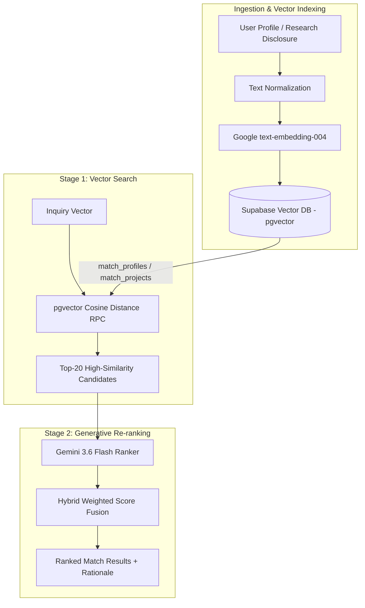

# Retrieval-Augmented Generation (RAG) System Architecture
## University of Ghana Virtual Industry Hub (UG-VIH)

---

## 1. Executive Summary & Architecture Overview

The **University of Ghana Virtual Industry Hub (UG-VIH)** implements a **Hybrid 2-Stage Retrieval-Augmented Generation (RAG)** pipeline connecting research disclosures, institutional partners, and investors.

Instead of relying solely on keyword searches or ungrounded LLM completions, UG-VIH pairs:
1. **Stage 1 (Dense Vector Retrieval)**: Powered by Google Gemini `text-embedding-004` (768 dimensions) and PostgreSQL `pgvector` similarity functions (`match_profiles` and `match_projects`).
2. **Stage 2 (Generative Synthesis & Re-ranking)**: Powered by `gemini-3.6-flash`, evaluating top candidate matches for qualitative synergy, skills overlap, and strategic alignment.


---

## 2. End-to-End Workflow Diagram



---

## 3. Mathematical Foundations & Formulations

### 3.1 Vector Embedding Mapping
An input document or user profile $T$ is mapped into a 768-dimensional space $\mathbb{R}^{768}$:

$$\vec{v} = f_{\text{embed}}(T) \in \mathbb{R}^{768}$$

### 3.2 Dimension Normalization & Zero-Vector Safety
Vector dimensions are strictly enforced to 768 dimensions with zero-vector baseline protection:

$$\vec{v}_{\text{norm}} = \begin{cases} \text{slice}(\vec{v}, 0, 768) & \text{if } |\vec{v}| > 768 \\ \vec{v} \parallel [0.001]^{768 - |\vec{v}|} & \text{if } |\vec{v}| < 768 \end{cases}$$

If $\forall i, |v_i| < 10^{-9}$:

$$\vec{v}_{\text{baseline}} = [0.001, 0.001, \dots, 0.001]^{T} \in \mathbb{R}^{768}$$

### 3.3 Cosine Similarity & Vector Distance
Given query vector $\vec{u}$ and candidate vector $\vec{v}$:

$$\text{Sim}(\vec{u}, \vec{v}) = \cos(\theta) = \frac{\vec{u} \cdot \vec{v}}{\|\vec{u}\|_2 \|\vec{v}\|_2} = \frac{\sum_{i=1}^{768} u_i v_i}{\sqrt{\sum_{i=1}^{768} u_i^2} \sqrt{\sum_{i=1}^{768} v_i^2}}$$

In PostgreSQL `pgvector`, cosine distance is computed as:

$$d_{\text{cosine}}(\vec{u}, \vec{v}) = 1 - \text{Sim}(\vec{u}, \vec{v})$$

The Stage 1 retrieval objective minimizes cosine distance:

$$\arg\min_{\vec{v} \in \mathcal{D}} d_{\text{cosine}}(\vec{u}, \vec{v})$$

### 3.4 Hybrid Scoring Fusion Formula
The final compatibility score $S_{\text{final}} \in [0, 100]$ fuses Stage 1 dense vector similarity with Stage 2 LLM qualitative score ($S_{\text{LLM}}$):

$$S_{\text{final}} = \alpha \cdot S_{\text{LLM}} + (1 - \alpha) \cdot \left(100 \times \text{Sim}(\vec{u}, \vec{v})\right)$$

Where $\alpha = 0.65$ balances qualitative AI reasoning with mathematical vector closeness.

---

## 4. Key Code Implementations

### 4.1 Embedding Generation (`services/embeddingService.ts`)

```typescript
import { GoogleGenAI } from "@google/genai";

export const EmbeddingService = {
  getEmbedding: async (text: string): Promise<number[]> => {
    const ai = new GoogleGenAI({ apiKey: process.env.GEMINI_API_KEY });
    const response = await ai.models.embedContent({
      model: 'text-embedding-004',
      contents: text,
    });
    const values = (response as any).embedding?.values || [];
    return EmbeddingService.ensureDimension(values, 768);
  }
};
```

---

### 4.2 Vector DB Retrieval RPC (`services/storageService.ts`)

```typescript
// Stage 1: Vector Search RPC Call
getMatches: async (userId: string, embedding: number[]) => {
  const queryVec = EmbeddingService.ensureDimension(embedding, 768);

  const { data: projects } = await supabase.rpc('match_projects', {
    query_embedding: queryVec,
    match_threshold: 0.0,
    match_count: 20
  });

  return filterByVisibility(projects, userId);
}
```

---

### 4.3 Generative Re-Ranking Engine (`services/matchingService.ts`)

```typescript
// Stage 2: Gemini 3.6 Flash Re-ranker
rankMatches: async (userProfile: AIProfile, candidates: any[]) => {
  const ai = new GoogleGenAI({ apiKey: process.env.GEMINI_API_KEY });
  const response = await ai.models.generateContent({
    model: 'gemini-3.6-flash',
    contents: `Rank candidates for user profile: ${JSON.stringify(userProfile)}: ${JSON.stringify(candidates.slice(0, 15))}`,
    config: { responseMimeType: "application/json" }
  });
  return JSON.parse(response.text);
}
```

---

## 5. Security & System Guarantees

1. **Row-Level Security Filtering**: Dynamic access control hides unapproved research disclosures before Stage 2 LLM prompt injection.
2. **In-Memory Caching**: Cache keys hash user profiles and candidate sets to prevent duplicate re-ranking API latency.
3. **Graceful Fallbacks**: If vector RPC queries return empty sets, fallback keyword indexing ensures continuous app operation.
